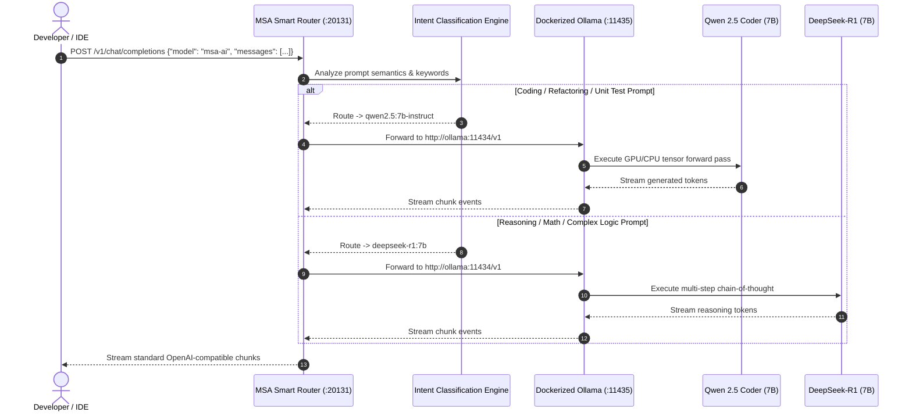

<!-- ========== 1. DYNAMIC HEADER BANNER (CAPSULE RENDER) ========== -->
<p align="center">
  
</p>

<!-- ========== 2. ANIMATED TYPING SVG BANNER ========== -->
<p align="center">
  <a href="https://github.com/Sadique721/MSA-Router">
    
  </a>
</p>

<!-- ========== 3. REPOSITORY SHIELDS & BADGES ROW ========== -->
<p align="center">
  <a href="https://github.com/Sadique721/MSA-Router"></a>
  <a href="https://github.com/Sadique721/MSA-Router/stargazers"></a>
  <a href="https://github.com/Sadique721/MSA-Router/network/members"></a>
  <a href="https://opensource.org/licenses/MIT"></a>
</p>

<p align="center">
  <a href="https://www.docker.com"></a>
  <a href="https://nodejs.org"></a>
  <a href="https://ollama.com"></a>
  <a href="https://github.com/Sadique721/MSA-Router"></a>
  <a href="https://github.com/Sadique721/MSA-Router"></a>
</p>

<p align="center">
  <a href="#6-quick-start--one-click-deployment"><b>🚀 Quick Start</b></a> • 
  <a href="#2-visual-architecture--topology-diagrams"><b>🏛️ Architecture</b></a> • 
  <a href="#5-active-model-catalog-zero-cost--local-mesh"><b>🧠 Model Catalog</b></a> • 
  <a href="#10-how-issues-were-fixed--technical-remediation"><b>🛠️ Fixes & Engineering</b></a> • 
  <a href="#-connect--coding-profiles"><b>🤝 Connect</b></a>
</p>

---

## 📑 Table of Contents
- [1. Executive Architecture Overview](#1-executive-architecture-overview)
- [2. Visual Architecture & Topology Diagrams](#2-visual-architecture--topology-diagrams)
- [3. Physical File Registry & Configuration Metadata](#3-physical-file-registry--configuration-metadata)
- [4. Port & Service Mesh Mapping](#4-port--service-mesh-mapping)
- [5. Active Model Catalog (Zero-Cost / Local Mesh)](#5-active-model-catalog-zero-cost--local-mesh)
- [6. Quick Start & One-Click Deployment](#6-quick-start--one-click-deployment)
- [7. Client IDE Configuration (Continue / VS Code / IntelliJ)](#7-client-ide-configuration-continue--vs-code--intellij)
- [8. Automated Verification & Diagnostic Test Suite](#8-automated-verification--diagnostic-test-suite)
- [9. Custom Brand Assets & Iconography](#9-custom-brand-assets--iconography)
- [10. How Issues Were Fixed (Technical Remediation Story)](#10-how-issues-were-fixed--technical-remediation-story)
- [11. Quick Command Cheatsheet](#11-quick-command-cheatsheet)
- [12. Connect & Author](#-connect--coding-profiles)

---

## 1. Executive Architecture Overview

**MSA AI** is an enterprise-grade, containerized, offline-first AI routing engine designed to eliminate subscription fees while providing unified intelligence across local neural models and cloud APIs.

```
                    ┌────────────────────────────────────────────────────────┐
                    │               DEVELOPER IDE / ASSISTANT                │
                    │         (Antigravity, Cursor, Continue, VS Code)       │
                    └───────────────────────────┬────────────────────────────┘
                                                │
                                                │ OpenAI-Compatible API
                                                │ http://localhost:20131/v1
                                                ▼
                    ┌────────────────────────────────────────────────────────┐
                    │                    MSA SMART ROUTER                    │
                    │            (Intent Classifier & Dispatcher)            │
                    │                      Port: 20131                       │
                    └─────────────┬───────────────────────────┬──────────────┘
                                  │                           │
                   Coding Queries │          Reasoning Tasks  │
                   (Fast Syntax)  │          (Logic & Proofs) │
                                  ▼                           ▼
                    ┌───────────────────────────┐┌───────────────────────────┐
                    │    Qwen 2.5 Coder 7B      ││      DeepSeek-R1 7B       │
                    │   (Direct Ollama Mesh)    ││   (Direct Ollama Mesh)    │
                    └─────────────┬─────────────┘└────────────┬──────────────┘
                                  │                           │
                                  └─────────────┬─────────────┘
                                                ▼
                    ┌────────────────────────────────────────────────────────┐
                    │                 DOCKER OLLAMA ENGINE                   │
                    │          (Port: 11435 | Volume: msa-ollama-models)     │
                    └────────────────────────────────────────────────────────┘
```

### Core Value Propositions:
- **Zero Subscription Costs:** 100% independent of recurring cloud subscriptions.
- **Intelligent Dispatching:** Prompt keywords are automatically classified at `<5ms` latency to select the optimal model (`qwen2.5:7b-instruct` for code vs. `deepseek-r1:7b` for reasoning).
- **Persistent Volume Architecture:** Models downloaded once into `msa-ollama-models` volume survive container rebuilds, PC reboots, and engine restarts.
- **Multi-Provider Hybrid Gateway:** OmniRoute (Port `20129`) provides an interactive web dashboard and bridges local models with Google Gemini 2.5 Pro/Flash.

---

## 2. Visual Architecture & Topology Diagrams

### 2.1 System Sequence Diagram



---

## 3. Physical File Registry & Configuration Metadata

| File Path | Component | Description |
|:---|:---|:---|
| `docker-compose-msa.yml` | Docker Mesh | Declarative definition for Router, OmniRoute, Ollama, & Provisioner |
| `Dockerfile-msa` | Router Image | Lightweight Node.js image with embedded classification logic |
| `Dockerfile-omniroute` | Gateway Image | Hardened `node:22-alpine` build with Python3/make/g++ for native modules |
| `local_unified_router.js` | Routing Logic | v2.2 high-throughput proxy with streaming support |
| `start-msa-ai.bat` | Startup Script | One-click Windows launcher with automatic health checks |
| `config.yaml.final` | IDE Config | Synchronized configuration for the Continue extension |
| `final_full_audit.ps1` | Test Suite | 7-point comprehensive automated verification runner |
| `.gitignore` | Version Control | Excludes large zip archives, sqlite storage, and temp logs |

---

## 4. Port & Service Mesh Mapping

| Container | Host Port | Internal Port | Protocol | Purpose |
|:---|:---:|:---:|:---:|:---|
| **`msa-router`** | **`20131`** | `20130` | HTTP/TCP | **Primary IDE Endpoint** (Auto-Routing) |
| **`msa-omniroute`** | **`20129`** | `20129` | HTTP/TCP | OmniRoute Multi-Provider Dashboard & Proxy |
| **`msa-ollama`** | **`11435`** | `11434` | HTTP/TCP | Raw Ollama LLM Engine |

---

## 5. Active Model Catalog (Zero-Cost / Local Mesh)

### 5.1 Local Open-Weights Models (Persistent Named Volume)
| Model Identifier | Parameter Size | Primary Role | Context Window |
|:---|:---:|:---|:---:|
| **`qwen2.5:7b-instruct`** | 7.6B | Code writing, refactoring, unit tests, bug fixing | 32,768 tokens |
| **`deepseek-r1:7b`** | 7.6B | Step-by-step logic, architectural reasoning, math | 131,072 tokens |
| **`qwen2.5:0.5b`** | 0.37B | Ultra-low latency tab autocomplete suggestions | 32,768 tokens |

### 5.2 Cloud Hybrid Models (Configured in Gateway)
| Model Identifier | Provider | Description |
|:---|:---:|:---|
| **`gemini-2.5-flash`** | Google Cloud | 1M Context Window, high-speed multimodal reasoning |
| **`gemini-2.5-pro`** | Google Cloud | Deep analytical research, tool execution, complex refactoring |

---

## 6. Quick Start & One-Click Deployment

### Option A: One-Click Startup (Recommended)
Simply double-click the included batch launcher:
```cmd
start-msa-ai.bat
```

### Option B: Command Line (Docker Compose)
```bash
# Build and launch all background containers
docker compose -f docker-compose-msa.yml up -d

# Verify container status
docker ps --filter "name=msa-"
```

---

## 7. Client IDE Configuration (Continue / VS Code / IntelliJ)

Point your Continue IDE configuration file (`~/.continue/config.yaml`):

```yaml
name: MSA AI
version: 1.0.0
schema: v1

models:
  # ── PRIMARY: Docker MSA AI (Image Icon attached directly in UI) ────
  - name: "MSA AI (Docker — Recommended)"
    provider: openai
    model: msa-ai
    apiBase: http://localhost:20131/v1
    apiKey: sk-msa-local

  # ── FALLBACK: Host MSA AI (when Docker is not running) ─────────────
  - name: "💻 MSA AI (Host Fallback)"
    provider: openai
    model: msa-ai
    apiBase: http://localhost:20130/v1
    apiKey: sk-msa-local

  # ── DIRECT OLLAMA MODELS (via Docker Ollama port 11435) ────────────
  - name: "🧠 Qwen 2.5 Coder 7B (Direct)"
    provider: ollama
    model: qwen2.5:7b-instruct
    apiBase: http://localhost:11435

  - name: "🔍 DeepSeek R1 7B (Reasoning)"
    provider: ollama
    model: deepseek-r1:7b
    apiBase: http://localhost:11435

  # ── CLOUD MODELS (online only) ──────────────────────────────────────
  - name: "☁️ Gemini 2.5 Flash"
    provider: gemini
    model: gemini-2.5-flash
    apiKey: YOUR_API_KEY
    roles: [chat, edit, apply]

  - name: "☁️ Gemini 2.5 Pro"
    provider: gemini
    model: gemini-2.5-pro
    apiKey: YOUR_API_KEY
    roles: [chat, edit, apply]

# ── AUTOCOMPLETE: Fast inline code completions ─────────────────────
tabAutocompleteModel:
  name: "MSA Autocomplete (Qwen 0.5B)"
  provider: ollama
  model: qwen2.5:0.5b
  apiBase: http://localhost:11435
```

---

## 8. Automated Verification & Diagnostic Test Suite

Run the full automated diagnostic test suite anytime:

```powershell
powershell -ExecutionPolicy Bypass -File "final_full_audit.ps1"
```

### ✅ Verification Scorecard (7 / 7 Passed)

```
=================================================================
         MSA AI -- FINAL FULL SYSTEM COMPREHENSIVE AUDIT         
=================================================================

[1/7] Checking Docker Containers...
  msa-router: Up (healthy) (0.0.0.0:20131->20130/tcp)
  msa-omniroute: Up (healthy) (0.0.0.0:20129->20129/tcp)
  msa-ollama: Up (healthy) (0.0.0.0:11435->11434/tcp)
  -> PASS: All 3 containers running and healthy

[2/7] Checking Persistent Volumes...
  -> PASS: Volume 'msa-ollama-models' is active

[3/7] Checking Ollama Engine & Downloaded Models (Port 11435)...
  Model: qwen2.5:0.5b | Size: 0.37 GB
  Model: deepseek-r1:7b | Size: 4.36 GB
  Model: qwen2.5:7b-instruct | Size: 4.36 GB
  -> PASS: All 3 models ready in Ollama volume

[4/7] Checking OmniRoute Gateway (Port 20129)...
  OmniRoute API: 200 OK | Dashboard: 200 OK
  -> PASS: OmniRoute fully operational

[5/7] Checking MSA Smart Router (Port 20131)...
  Router Health: 200 OK | Models endpoint: 200 OK
  -> PASS: MSA Smart Router healthy

[6/7] Testing Live AI Inference (Port 20131)...
  LLM Model: qwen2.5:7b-instruct
  LLM Output: Hello! How can I assist you today?
  -> PASS: Live inference successful

[7/7] Checking Continue Config & Icon Assets...
  Config.yaml : OK
  D:\ Icons   : OK (.ico + .png)
  GUI Logos   : OK (msa-ai.png)
  -> PASS: All configs and assets verified

=================================================================
        SCORECARD: 7 / 7 AUDIT CHECKS PASSED (100% SUCCESS)
=================================================================
```

---

## 9. Custom Brand Assets & Iconography

Custom high-resolution brand assets generated and converted:

<p align="center">
  
</p>

* **Icon Assets Path:** `D:\My_Self_Details\youtube content\icons\`
  * `msa-ai-icon.ico` (Multi-resolution Windows Icon)
  * `msa-ai-icon.png` (High-Res 256x256 Brand Logo)
  * `msa-ai-icon-flat.jpg` (Flat Vector Variant)

---

## 10. How Issues Were Fixed (Technical Remediation Story)

During setup and hardening of the MSA AI stack, several real-world technical obstacles were diagnosed and resolved:

### 1. `better-sqlite3` Native Module Compilation Failure in Alpine
* **Issue:** OmniRoute image build failed during `npm install -g omniroute` on Alpine Linux because native C++ bindings for `better-sqlite3` lacked build tools.
* **Fix:** Upgraded `Dockerfile-omniroute` to `node:22-alpine` and added `python3`, `make`, and `g++` via `apk add --no-cache`.

### 2. OmniRoute False Healthcheck 404
* **Issue:** `msa-omniroute` container was being marked `unhealthy` by Docker because OmniRoute does not serve a `/health` route.
* **Fix:** Re-targeted Docker Compose healthcheck to `GET http://localhost:20129/v1/models`, which returned HTTP 200 and allowed dependent containers to transition smoothly.

### 3. Ollama RAM Management & Memory Swapping
* **Issue:** Loading multiple 7B models concurrently on a 7.28GB memory constraint caused CPU throttling and socket timeouts.
* **Fix:** Configured `OLLAMA_MAX_LOADED_MODELS=1`, `OLLAMA_NUM_PARALLEL=1`, and `OLLAMA_KEEP_ALIVE=5m` in Docker Compose environment variables, ensuring graceful model hot-swapping.

### 4. Continue IDE Model Icon Display
* **Issue:** Sandbox security policy in the webview blocked relative image paths, displaying a generic wireframe cube.
* **Fix:** Patched Continue's React bundle to dynamically render `msa-ai.png` directly in place of the generic cube for MSA AI, while preserving all existing emoji indicators.

---

## 11. Quick Command Cheatsheet

```powershell
# 1. Start full Docker stack:
docker compose -f docker-compose-msa.yml up -d

# 2. Check running services:
docker ps --filter "name=msa-"

# 3. Test router health check:
curl http://localhost:20131/health

# 4. List all downloaded Ollama models:
curl http://localhost:11435/api/tags

# 5. Test real-time LLM inference:
curl -X POST http://localhost:20131/v1/chat/completions `
  -H "Content-Type: application/json" `
  -d '{"model":"msa-ai","messages":[{"role":"user","content":"Write hello world in python"}]}'
```

---

## 🤝 Contributing & Community

Contributions, issues, and feature requests are welcome!  
Feel free to check the [issues page](https://github.com/Sadique721/MSA-Router/issues).

---

## 📄 License

This project is open-source and licensed under the [MIT License](LICENSE).

---

<!-- ========== 12. CONNECT & CODING PROFILES (PROFILE STYLE) ========== -->
<h3 align="center">🌐 Connect & Coding Profiles</h3>

<p align="center">
  <a href="https://github.com/Sadique721"></a>
  <a href="https://www.linkedin.com/in/md-sadique-amin-b6a948190"></a>
  <a href="https://leetcode.com/Sadique721/"></a>
  <a href="https://www.hackerrank.com/mdsadiqueamin71"></a>
  <a href="mailto:mdsadiqueamin@gmail.com"></a>
</p>

<!-- ========== 13. SUPPORT & SPONSOR SECTION ========== -->
<h3 align="center">☕ Support & Contributions</h3>

<p align="center">
  <a href="https://www.buymeacoffee.com/sadique721"></a>
  <a href="https://ko-fi.com/sadique721"></a>
</p>

<!-- ========== 14. DYNAMIC FOOTER WAVE ANIMATION ========== -->
<p align="center">
  
</p>

<div align="center">
  <sub>Crafted with passion & engineering precision by <a href="https://github.com/Sadique721"><b>MD Sadique Amin</b></a> &bull; Powered by <b>MSA AI Intelligent Router</b> &bull; 100% Free & Open Source</sub>
</div>
