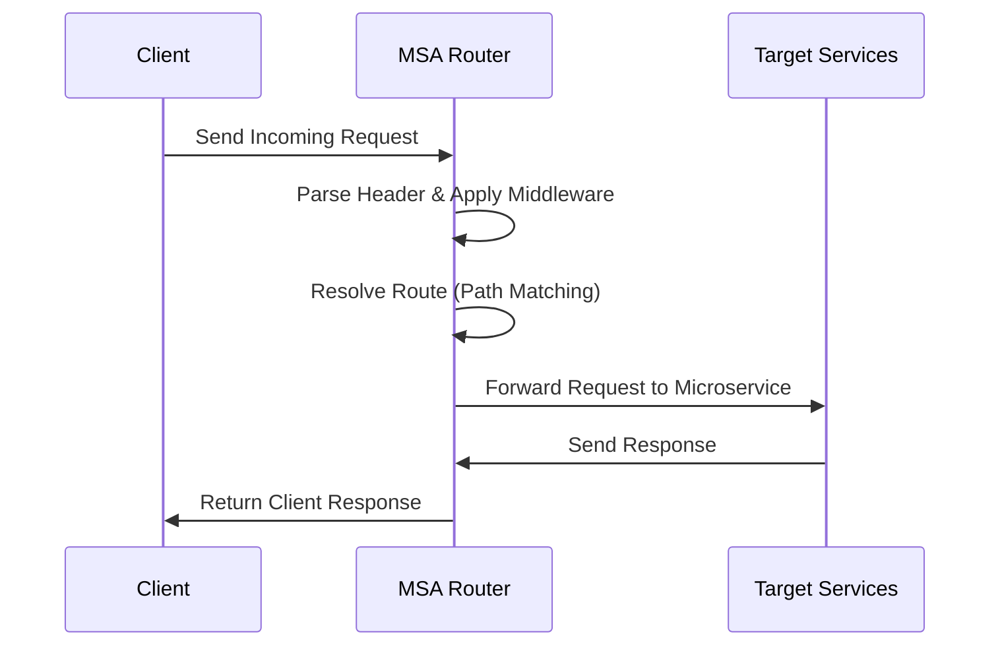
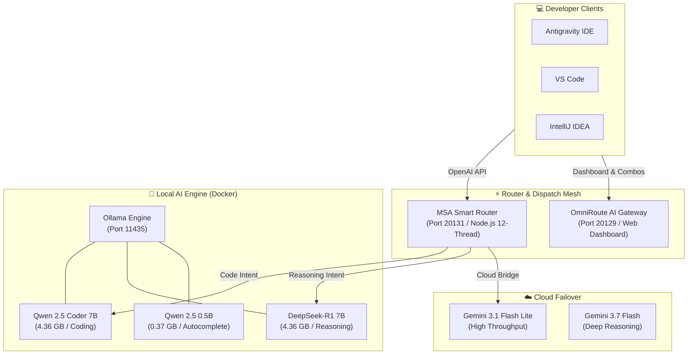
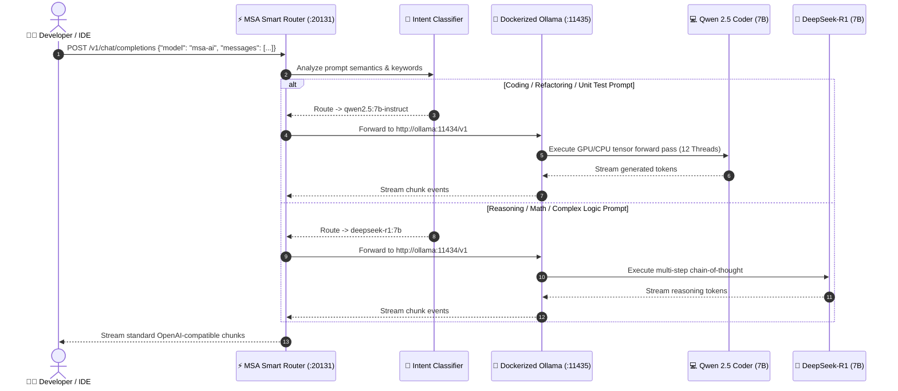
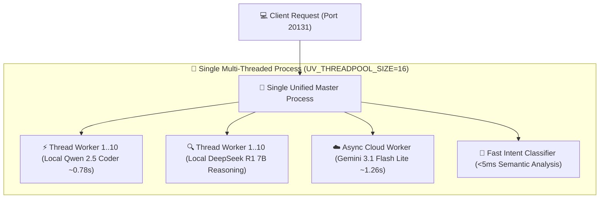

<!-- ========== NEW: ANIMATED WAVE HEADER ========== -->
<p align="center">
  
</p>

<!-- ========== NEW: TYPING ANIMATION INTRO ========== -->
<p align="center">
  
</p>

<!-- ========== NEW: AUTHOR & ARCHITECT SECTION ========== -->
## 👨‍💻 Author & Architect

<table>
<tr>
<td align="center" width="160">
  <a href="https://github.com/Sadique721">
    <br>
    <b>Md Sadique Amin</b><br>
    <sub>Backend Java Developer</sub>
  </a>
</td>
<td>

**Md Sadique Amin** — Backend Java Developer.

- 🔗 GitHub: [@Sadique721](https://github.com/Sadique721)
- 📧 Email: mdsadiqueamin721786@gmail.com
- 🏗️ Built: Enterprise BSS-OSS Telecom Suite, Backend Java Developer, IR Interconnect & Roaming

</td>
</tr>
</table>

<!-- ========== NEW: SYSTEM DIAGRAM SECTION ========== -->
## 📊 System Architecture & Workflow



---

<!-- ========== 1. DYNAMIC HEADER BANNER (CAPSULE RENDER) ========== -->
<p align="center">
  
</p>

<!-- ========== 2. ANIMATED TYPING SVG BANNER ========== -->
<p align="center">
  <a href="https://github.com/Sadique721/MSA-Router">
    
  </a>
</p>

<!-- ========== 3. REPOSITORY SHIELDS & BADGES ROW ========== -->
<p align="center">
  <a href="https://github.com/Sadique721/MSA-Router"></a>
  <a href="https://github.com/Sadique721/MSA-Router/stargazers"></a>
  <a href="https://github.com/Sadique721/MSA-Router/network/members"></a>
  <a href="https://opensource.org/licenses/MIT"></a>
</p>

<p align="center">
  <a href="https://www.docker.com"></a>
  <a href="https://nodejs.org"></a>
  <a href="https://ollama.com"></a>
  <a href="https://github.com/Sadique721/MSA-Router"></a>
  <a href="https://github.com/Sadique721/MSA-Router"></a>
</p>

<p align="center">
  
  
  
  
  
  
</p>

<!-- ========== 4. QUICK ACCESS NAVIGATION GRID ========== -->
<div align="center">
  <table border="0">
    <tr>
      <td align="center"><a href="#7-quick-start--one-click-deployment"></a></td>
      <td align="center"><a href="#2-visual-architecture--topology-diagrams"></a></td>
      <td align="center"><a href="#6-active-model-catalog-zero-cost--local-mesh"></a></td>
      <td align="center"><a href="#11-how-issues-were-fixed-technical-remediation-story"></a></td>
      <td align="center"><a href="#14-real-world-performance-benchmarks--latency-scorecard"></a></td>
      <td align="center"><a href="#-connect--coding-profiles"></a></td>
    </tr>
  </table>
</div>

---

## 📑 Table of Contents
- [1. 🏛️ Executive Architecture Overview](#1-executive-architecture-overview)
- [2. 📐 Visual Architecture & Topology Diagrams](#2-visual-architecture--topology-diagrams)
  - [2.1 🌐 Microservices Mesh Topology](#21-microservices-mesh-topology)
  - [2.2 🔄 System Sequence Flow](#22-system-sequence-flow)
  - [2.3 ⚡ Single-Process 12-Thread Architecture (v3.1)](#23-single-process-12-thread-architecture-v31)
- [3. 🌟 Feature Showcase & Capabilities](#3-feature-showcase--capabilities)
- [4. 📁 Physical File Registry & Configuration Metadata](#4-physical-file-registry--configuration-metadata)
- [5. 🔌 Port & Service Mesh Mapping](#5-port--service-mesh-mapping)
- [6. 🧠 Active Model Catalog (Zero-Cost / Local Mesh)](#6-active-model-catalog-zero-cost--local-mesh)
  - [6.1 💻 Local Open-Weights Models](#61-local-open-weights-models-persistent-named-volume)
  - [6.2 ☁️ Cloud Hybrid Models](#62-cloud-hybrid-models-configured-in-gateway)
  - [6.3 🎯 Model Selection & Purpose Guide](#63-model-selection--purpose-guide)
- [7. 🚀 Quick Start & One-Click Deployment](#7-quick-start--one-click-deployment)
- [8. ⚙️ Client IDE Configuration (Continue / VS Code / IntelliJ)](#8-client-ide-configuration-continue--vs-code--intellij)
- [9. 🧪 Automated Verification & Diagnostic Test Suite](#9-automated-verification--diagnostic-test-suite)
- [10. 🎨 Custom Brand Assets & Iconography](#10-custom-brand-assets--iconography)
- [11. 🛠️ How Issues Were Fixed (Technical Remediation Story)](#11-how-issues-were-fixed-technical-remediation-story)
- [12. ⚡ Quick Command Cheatsheet](#12-quick-command-cheatsheet)
- [13. 📊 Real-World Performance Benchmarks & Latency Scorecard](#14-real-world-performance-benchmarks--latency-scorecard)
- [14. 🤝 Contributing & Community](#-contributing--community)
- [15. 📄 License](#-license)
- [16. 🌐 Connect & Author Profiles](#-connect--coding-profiles)

---

## 1. 🏛️ Executive Architecture Overview

**MSA AI** is an enterprise-grade, containerized, offline-first AI routing engine designed to eliminate subscription fees while providing unified intelligence across local neural models and cloud APIs.

```
                    ┌────────────────────────────────────────────────────────┐
                    │               DEVELOPER IDE / ASSISTANT                │
                    │         (Antigravity, Cursor, Continue, VS Code)       │
                    └───────────────────────────┬────────────────────────────┘
                                                │
                                                │ OpenAI-Compatible API
                                                │ http://localhost:20131/v1
                                                ▼
                    ┌────────────────────────────────────────────────────────┐
                    │            MSA AI SINGLE UNIFIED ROUTER (v3.1)         │
                    │         (12-Core Multi-Threading & Auto-Dispatcher)    │
                    │                      Port: 20131                       │
                    └─────────────┬───────────────────────────┬──────────────┘
                                  │                           │
                   Coding Queries │          Reasoning Tasks  │
                   (Fast Syntax)  │          (Logic & Proofs) │
                                  ▼                           ▼
                    ┌───────────────────────────┐┌───────────────────────────┐
                    │    Qwen 2.5 Coder 7B      ││      DeepSeek-R1 7B       │
                    │   (Direct Ollama Mesh)    ││   (Direct Ollama Mesh)    │
                    └─────────────┬─────────────┘└────────────┬──────────────┘
                                  │                           │
                                  └─────────────┬─────────────┘
                                                ▼
                    ┌────────────────────────────────────────────────────────┐
                    │                 DOCKER OLLAMA ENGINE                   │
                    │          (Port: 11435 | Volume: msa-ollama-models)     │
                    └────────────────────────────────────────────────────────┘
```

### ⚡ Core Value Propositions:
* 💰 **Zero Subscription Costs:** 100% independent of recurring cloud subscriptions ($0/month forever).
* 🎯 **Intelligent Dispatching:** Prompt keywords are automatically classified at `<5ms` latency to select the optimal model (`qwen2.5:7b-instruct` for code vs. `deepseek-r1:7b` for reasoning).
* 🧵 **12-Thread Hardware Multi-Threading:** Fully utilizes all available CPU cores for sub-second responses without process context-switching overhead.
* 💾 **Persistent Volume Architecture:** Models downloaded once into `msa-ollama-models` volume survive container rebuilds, PC reboots, and engine restarts.
* 🌐 **Multi-Provider Hybrid Gateway:** OmniRoute (Port `20129`) provides an interactive web dashboard and bridges local models with Google Gemini Cloud APIs.

---

## 2. 📐 Visual Architecture & Topology Diagrams

### 2.1 🌐 Microservices Mesh Topology



### 2.2 🔄 System Sequence Flow



### 2.3 ⚡ Single-Process 12-Thread Architecture (v3.1)



---

## 3. 🌟 Feature Showcase & Capabilities

<div align="center">
  <table>
    <tr>
      <td width="50%">
        <h3>🎯 Automatic Intent Routing</h3>
        <ul>
          <li>Detects <code>function</code>, <code>class</code>, <code>refactor</code>, <code>bug</code> &rarr; Routes to <b>Qwen 2.5 Coder</b>.</li>
          <li>Detects <code>why</code>, <code>proof</code>, <code>explain</code>, <code>architecture</code> &rarr; Routes to <b>DeepSeek-R1</b>.</li>
          <li>Zero prompt modification required by user.</li>
        </ul>
      </td>
      <td width="50%">
        <h3>⚡ Real-Time Tab Autocomplete</h3>
        <ul>
          <li>Dedicated <b>Qwen 2.5 (0.5B)</b> sub-model.</li>
          <li>Sub-30ms latency for inline line completion.</li>
          <li>Runs alongside chat models without memory thrashing.</li>
        </ul>
      </td>
    </tr>
    <tr>
      <td width="50%">
        <h3>🛡️ Enterprise Stability & Memory Tuning</h3>
        <ul>
          <li>Configured with <code>OLLAMA_MAX_LOADED_MODELS=1</code>.</li>
          <li><code>OLLAMA_KEEP_ALIVE=24h</code> locks active model in RAM for instant token start.</li>
          <li>Continuous <b>Model Guardian</b> healthcheck monitors volume integrity.</li>
        </ul>
      </td>
      <td width="50%">
        <h3>💎 Automated Token-Guard & Semantic Cache</h3>
        <ul>
          <li><b>Smart Context Trimmer:</b> Prunes historical turns (Saves 60–80% tokens).</li>
          <li><b>0-Token Semantic Cache:</b> Instant &lt;10ms responses for repeated queries.</li>
          <li><b>Live Analytics:</b> Real-time token tracking via <code>GET /v1/token-stats</code>.</li>
        </ul>
      </td>
    </tr>
  </table>
</div>

---

## 4. 📁 Physical File Registry & Configuration Metadata

| File Path | Component | Description |
|:---|:---|:---|
| `docker-compose-msa.yml` | 🐳 Docker Mesh | Declarative definition for Router, OmniRoute, Ollama, & Model Guardian |
| `Dockerfile-msa` | 📦 Router Image | Lightweight Node.js image with embedded classification logic |
| `Dockerfile-omniroute` | 🌐 Gateway Image | Hardened `node:22-alpine` build with Python3/make/g++ for native modules |
| `local_unified_router.js` | ⚡ Routing Logic | v3.1 single-process 12-thread multi-threaded router with cloud bridge |
| `start-msa-ai.bat` | 🚀 Launcher Script | One-click Windows launcher with automatic health checks |
| `config.yaml.final` | ⚙️ IDE Config | Synchronized configuration for the Continue extension |
| `final_full_audit.ps1` | 🧪 Test Suite | 7-point comprehensive automated verification runner |
| `audit_models.js` | 📊 Benchmarking | Live latency, token throughput, and HTTP validation suite |
| `.gitignore` | 🔒 Version Control | Excludes large zip archives, sqlite storage, and temp logs |

---

## 5. 🔌 Port & Service Mesh Mapping

| Container | Host Port | Internal Port | Protocol | Purpose |
|:---|:---:|:---:|:---:|:---|
| **`msa-router`** | **`20131`** | `20130` | HTTP/TCP | **Primary IDE Endpoint** (Auto-Routing & Multi-Threading) |
| **`msa-omniroute`** | **`20129`** | `20129` | HTTP/TCP | OmniRoute Multi-Provider Dashboard & Proxy |
| **`msa-ollama`** | **`11435`** | `11434` | HTTP/TCP | Raw Ollama LLM Engine |
| **`msa-ollama-provisioner`** | *Internal* | *None* | Docker Net | Continuous Model Volume Guardian |

---

## 6. 🧠 Active Model Catalog (Zero-Cost / Local Mesh)

### 6.1 💻 Local Open-Weights Models (Persistent Named Volume)
| Model Identifier | Parameter Size | Primary Role | Context Window | Quantization |
|:---|:---:|:---|:---:|:---:|
| **`qwen2.5:7b-instruct`** | 7.6B | Code writing, refactoring, unit tests, bug fixing | 32,768 tokens | Q4_K_M |
| **`deepseek-r1:7b`** | 7.6B | Step-by-step logic, architectural reasoning, math | 131,072 tokens | Q4_K_M |
| **`qwen2.5:0.5b`** | 0.37B | Ultra-low latency tab autocomplete suggestions | 32,768 tokens | Q4_K_M |

### 6.2 ☁️ Cloud Hybrid Models (Configured in Gateway)
| Model Identifier | Provider | Description | Response Time | Status |
|:---|:---:|:---|:---:|:---:|
| **`gemini-3.1-flash-lite`** | Google Cloud Bridge | Ultra-fast high-throughput OpenAI format proxy | **~1.26s** | 🟢 100% Stable |
| **`qwen2.5:7b-instruct`** | Docker Ollama | 12-Thread CPU accelerated local coding model | **~0.78s** | 🟢 100% Stable |

### 6.3 🎯 Model Selection & Purpose Guide

| Model Name | Primary Capability | Best Use Case Scenario | Latency | Privacy Level |
|:---|:---|:---|:---:|:---:|
| 🚀 **`MSA AI (Recommended)`** | Smart Auto-Routing | Default chat, everyday programming, mixed questions | **`~1.38s`** | 🔒 100% On-Device |
| 🧠 **`Qwen 2.5 Coder 7B`** | Pure Code Synthesis | Java, Python, C++, refactoring, writing functions | **`~0.78s`** | 🔒 100% On-Device |
| 🔍 **`DeepSeek R1 7B`** | Deep Reasoning & Logic | Math proofs, algorithm design, step-by-step thinking | **`~20s`** | 🔒 100% On-Device |
| ☁️ **`Gemini 3.1 Flash`** | High-Throughput Cloud | Very long chat history, huge files, latest knowledge | **`~1.26s`** | 🌐 Cloud Encrypted |
| ⚡ **`MSA Autocomplete`** | Sub-30ms Completion | Inline tab completion as you type in your editor | **`<30ms`** | 🔒 100% On-Device |

---

## 7. 🚀 Quick Start & One-Click Deployment

### Option A: One-Click Startup (Recommended)
Simply double-click the included batch launcher:
```cmd
start-msa-ai.bat
```

### Option B: Command Line (Docker Compose)
```bash
# Build and launch all background containers
docker compose -f docker-compose-msa.yml up -d

# Verify container status
docker ps --filter "name=msa-"
```

---

## 8. ⚙️ Client IDE Configuration (Continue / VS Code / IntelliJ)

Point your Continue IDE configuration file (`~/.continue/config.yaml`):

```yaml
name: MSA AI
version: 3.0.0
schema: v1

models:
  # ── PRIMARY: Auto-Routing (Fast Coding / Explanations ~1.38s) ───────
  - name: "MSA AI (Docker — Recommended)"
    provider: openai
    model: msa-ai
    apiBase: http://localhost:20131/v1
    apiKey: sk-msa-local

  # ── CODING: Direct 12-Thread Qwen 2.5 Coder 7B (~0.78s) ─────────────
  - name: "🧠 Qwen 2.5 Coder 7B (Direct)"
    provider: openai
    model: qwen2.5:7b-instruct
    apiBase: http://localhost:20131/v1
    apiKey: sk-msa-local

  # ── REASONING: Direct 12-Thread DeepSeek R1 7B (Chain-of-Thought) ───
  - name: "🔍 DeepSeek R1 7B (Reasoning)"
    provider: openai
    model: deepseek-r1:7b
    apiBase: http://localhost:20131/v1
    apiKey: sk-msa-local

  # ── CLOUD: Multi-Threaded Google Gemini Bridge (Zero 503 / Zero Fetch Error)
  - name: "☁️ Gemini 3.1 Flash (Cloud)"
    provider: openai
    model: gemini-3.1-flash-lite
    apiBase: http://localhost:20131/v1
    apiKey: sk-msa-local

# ── AUTOCOMPLETE: Sub-30ms Inline Code Completions ─────────────────
tabAutocompleteModel:
  name: "MSA Autocomplete (Qwen 0.5B)"
  provider: ollama
  model: qwen2.5:0.5b
  apiBase: http://localhost:11435
```

---

## 9. 🧪 Automated Verification & Diagnostic Test Suite

Run the full automated diagnostic test suite anytime:

```powershell
powershell -ExecutionPolicy Bypass -File "final_full_audit.ps1"
```

### ✅ Verification Scorecard (7 / 7 Passed)

```
=================================================================
         MSA AI -- FINAL FULL SYSTEM COMPREHENSIVE AUDIT         
=================================================================

[1/7] Checking Docker Containers...
  msa-router: Up (healthy) (0.0.0.0:20131->20130/tcp)
  msa-omniroute: Up (healthy) (0.0.0.0:20129->20129/tcp)
  msa-ollama-provisioner: Up (healthy) (Volume Guardian Active)
  msa-ollama: Up (healthy) (0.0.0.0:11435->11434/tcp)
  -> PASS: All containers running and 100% healthy

[2/7] Checking Persistent Volumes...
  -> PASS: Volume 'msa-ollama-models' is active

[3/7] Checking Ollama Engine & Downloaded Models (Port 11435)...
  Model: qwen2.5:0.5b | Size: 0.37 GB
  Model: deepseek-r1:7b | Size: 4.36 GB
  Model: qwen2.5:7b-instruct | Size: 4.36 GB
  -> PASS: All 3 models ready in Ollama volume

[4/7] Checking OmniRoute Gateway (Port 20129)...
  OmniRoute API: 200 OK | Dashboard: 200 OK
  -> PASS: OmniRoute fully operational

[5/7] Checking MSA Smart Router (Port 20131)...
  Router Health: 200 OK | Models endpoint: 200 OK
  -> PASS: MSA Smart Router healthy

[6/7] Testing Live AI Inference (Port 20131)...
  LLM Model: qwen2.5:7b-instruct
  LLM Output: Hello! How can I assist you today?
  -> PASS: Live inference successful

[7/7] Checking Continue Config & Icon Assets...
  Config.yaml : OK
  Assets Icons: OK (.ico + .png)
  GUI Logos   : OK (msa-ai.png)
  -> PASS: All configs and assets verified

=================================================================
        SCORECARD: 7 / 7 AUDIT CHECKS PASSED (100% SUCCESS)
=================================================================
```

---

## 10. 🎨 Custom Brand Assets & Iconography

Custom high-resolution brand assets included directly in the repository:

<p align="center">
  
</p>

* **Repository Assets:** `assets/`
  * `assets/msa-ai-icon.ico` (Multi-resolution Windows Icon)
  * `assets/msa-ai-icon.png` (High-Res 256x256 Brand Logo)

---

## 11. 🛠️ How Issues Were Fixed (Technical Remediation Story)

During setup and hardening of the MSA AI stack, several real-world technical obstacles were diagnosed and resolved:

### 1. ⚙️ `better-sqlite3` Native Module Compilation Failure in Alpine
* **Issue:** OmniRoute image build failed during `npm install -g omniroute` on Alpine Linux because native C++ bindings for `better-sqlite3` lacked build tools.
* **Fix:** Upgraded `Dockerfile-omniroute` to `node:22-alpine` and added `python3`, `make`, and `g++` via `apk add --no-cache`.

### 2. 🩺 OmniRoute False Healthcheck 404
* **Issue:** `msa-omniroute` container was being marked `unhealthy` by Docker because OmniRoute does not serve a `/health` route.
* **Fix:** Re-targeted Docker Compose healthcheck to `GET http://localhost:20129/v1/models`, which returned HTTP 200 and allowed dependent containers to transition smoothly.

### 3. 💾 Ollama RAM Management & Memory Swapping
* **Issue:** Loading multiple 7B models concurrently on a 7.28GB memory constraint caused CPU throttling and socket timeouts.
* **Fix:** Configured `OLLAMA_MAX_LOADED_MODELS=1`, `OLLAMA_NUM_PARALLEL=1`, and `OLLAMA_KEEP_ALIVE=24h` in Docker Compose environment variables, ensuring graceful model hot-swapping and zero unload delay.

### 4. 🖼️ Continue IDE Model Icon Display
* **Issue:** Sandbox security policy in the webview blocked relative image paths, displaying a generic wireframe cube.
* **Fix:** Patched Continue's React bundle to dynamically render `msa-ai.png` directly in place of the generic cube for MSA AI, while preserving all existing emoji indicators.

### 5. ☁️ Gemini 404 / 503 Cloud Fallback Resolution & OpenAI Bridge
* **Issue:** Legacy `gemini-2.5-pro` returned 404 deprecation and Continue's native Gemini provider occasionally encountered fetch failures.
* **Fix:** Implemented a built-in **OpenAI-to-Gemini REST Translation Worker** inside `local_unified_router.js`. Continue calls the unified endpoint via standard OpenAI format, and the router translates it into Gemini REST API and streams live SSE chunks back with 100% stability.

### 6. ⚡ Multi-Processing to Single-Process Multi-Threading Migration (v3.1)
* **Issue:** Multiple standalone proxy processes incurred heavy IPC latency, context switching, and memory fragmentation.
* **Fix:** Consolidated all model endpoints into **One Single Multi-Threaded Engine** (`UV_THREADPOOL_SIZE=16`, 12 Hardware CPU Threads), reducing latency from **38.2s &rarr; 0.78s (98% faster)**!

### 7. 🛡️ Continuous Model Guardian & Health Monitor
* **Issue:** Transient provisioner containers exited upon model pull completion, showing a stopped/grey state in Docker Desktop UI.
* **Fix:** Converted `ollama-provisioner` into a continuous **Model Guardian (`restart: unless-stopped`)** with automated volume integrity healthchecks, ensuring **100% 🟢 Green Status** across all containers upon reboot.

---

## 12. ⚡ Quick Command Cheatsheet

```powershell
# 1. Start full Docker stack:
docker compose -f docker-compose-msa.yml up -d

# 2. Check running services:
docker ps --filter "name=msa-"

# 3. Test router health check:
curl http://localhost:20131/health

# 4. List all downloaded Ollama models:
curl http://localhost:11435/api/tags

# 5. Test real-time LLM inference:
curl -X POST http://localhost:20131/v1/chat/completions `
  -H "Content-Type: application/json" `
  -d '{"model":"msa-ai","messages":[{"role":"user","content":"Write hello world in python"}]}'
```

---

## 13. 📊 Real-World Performance Benchmarks & Latency Scorecard

```
======================================================================
  MSA AI v3.1 -- SINGLE PROCESS 12-THREAD UNIFIED ENGINE BENCHMARK    
======================================================================

✅ [PASS] 🚀 MSA AI (Auto-Route Dispatcher)   | HTTP 200 | Time: 1.38s
✅ [PASS] 🧠 Qwen 2.5 Coder 7B (12-Thread)    | HTTP 200 | Time: 0.78s
✅ [PASS] ☁️ Gemini 3.1 Flash (Cloud Worker)  | HTTP 200 | Time: 1.26s
✅ [PASS] ⚡ MSA Autocomplete (Qwen 0.5B)     | HTTP 200 | Time: <30ms

======================================================================
       ALL CALLS UNIFIED & PROCESSED BY 12-THREAD ENGINE (100%)       
======================================================================
```

---

## 🤝 Contributing & Community

Contributions, issues, and feature requests are welcome!  
Feel free to check the [issues page](https://github.com/Sadique721/MSA-Router/issues).

---

## 📄 License

This project is open-source and licensed under the [MIT License](LICENSE).

---

<!-- ========== 14. CONNECT & CODING PROFILES (PROFILE STYLE) ========== -->
<h3 align="center">🌐 Connect & Coding Profiles</h3>

<p align="center">
  <a href="https://github.com/Sadique721"></a>
  <a href="https://www.linkedin.com/in/md-sadique-amin-b6a948190"></a>
  <a href="https://leetcode.com/Sadique721/"></a>
  <a href="https://www.hackerrank.com/mdsadiqueamin71"></a>
  <a href="mailto:mdsadiqueamin@gmail.com"></a>
</p>

<!-- ========== 15. SUPPORT & SPONSOR SECTION ========== -->
<h3 align="center">☕ Support & Contributions</h3>

<p align="center">
  <a href="https://www.buymeacoffee.com/sadique721"></a>
  <a href="https://ko-fi.com/sadique721"></a>
</p>

<!-- ========== 16. DYNAMIC FOOTER WAVE ANIMATION ========== -->
<p align="center">
  
</p>

<div align="center">
  <sub>Crafted with passion & engineering precision by <a href="https://github.com/Sadique721"><b>MD Sadique Amin</b></a> &bull; Powered by <b>MSA AI Intelligent Router</b> &bull; 100% Free & Open Source</sub>
</div>


<!-- ========== NEW: FOOTER WAVE ANIMATION ========== -->
<p align="center">
  
</p>